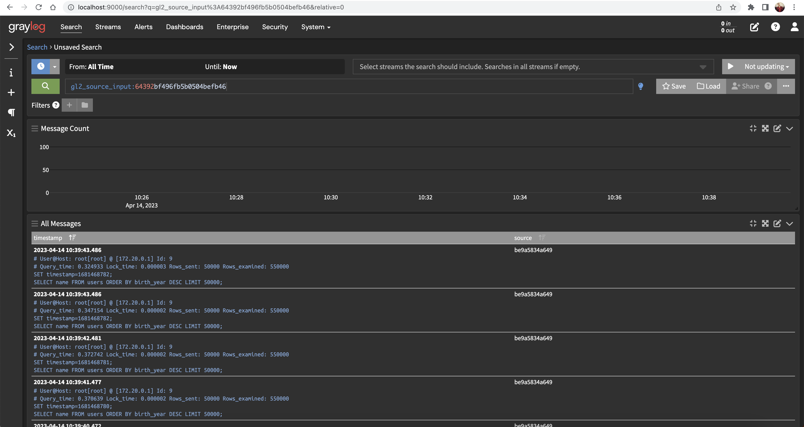
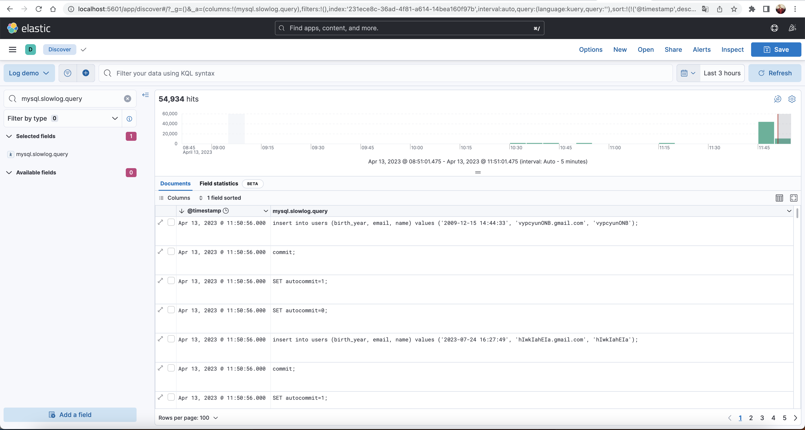

# Logging demo

---
The demo is written in python 3 and uses docker-compose to run MySQL and logging stack.

The `log-demo.py` will create users table, enrich this table by test data(500000 rows) and 
will send 10 requests(with 3 repeats) to db with diff `long_query_time` 0, 1, 10. 

SQL: `SELECT name FROM users ORDER BY birth_year DESC LIMIT 50000`

The [elk-docker-compose.yaml](elk-docker-compose.yaml) file contains setups for ELK logging stack.

The [graylog-docker-compose.yaml](graylog-docker-compose.yaml) file contains setups for Graylog logging stack.


## How to build and run

---
Start up Docker containers with elk stack or graylog stack:
 1. ```
    docker-compose -f elk-docker-compose.yml up -d
    ```
 2. ```
    docker-compose -f graylog-docker-compose.yml up -d
    ```

Build and run demo application:
1. Install libs ```pip install mysql.connector Faker```
2. Run script ```python3 log-demo.py```

## Test results

---
1. SET GLOBAL long_query_time = 10

   Result: 1.3089471516s, 1.3722850236000002s, 1.3852859722000002s


2. SET GLOBAL long_query_time = 1

   Result: 1.2436999566999993s, 1.2445695400000005s, 1.2439035747000005s


3. SET GLOBAL long_query_time = 0

   Result: 1.2279076075000006s, 1.2568538099000008s, 1.2234499717999996s


## Graylog dashboard

---



## ELK dashboard

---



